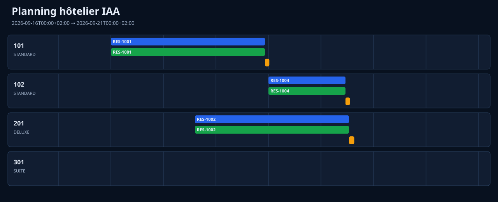

# Hotel Reservation — business component

This dependency-free Python reference component demonstrates deterministic
hotel reservation rules and produces a visual planning board for reservations,
room cleaning, and magnetic-key activation windows. It also generates a guest
record with hotel and restaurant history.



## Implemented rules

- A room is assigned only when its occupancy and post-checkout cleaning window
  do not overlap another confirmed stay.
- A sufficient deposit is required to confirm a reservation. An insufficient
  deposit returns `PENDING_DEPOSIT`, does not block inventory, and creates no
  active key window.
- Cancellation is free up to and including exactly 48 hours before arrival.
- A VIP request is assigned the first available higher category; it falls back
  to the requested category when no upgrade is available.
- A confirmed reservation activates its magnetic key from arrival until
  departure. The exact start, end, and duration in minutes are published.
- Cleaning starts at departure and lasts for the room's configured duration.
- A guest record exposes birthday, VIP status, preferred language, confirmed
  stay count and duration, and restaurant reservations with date and duration.

All time ranges are half-open (`[start, end)`) and timezone-aware. Monetary
values are integer cents. Candidate selection is stable: category priority,
then ascending room identifier.

## Run

The verification currently runs 21 deterministic tests with Python's standard
library only.

```bash
components/argos/business/hotel_reservation/verify.sh
python3 components/argos/business/hotel_reservation/generate_demo.py
```

Launch IRIS with the canonical scenario. IRIS activates ARGOS and AORATOS:

```bash
./iris/launch.sh \
  --component components/argos/business/hotel_reservation \
  --input components/argos/business/hotel_reservation/demo/argos-scenario.json
```

IRIS owns startup. ARGOS admits the component and dispatches the
`IAA.ARGOS.BUSINESS.SCENARIO.v1` commands. AORATOS is activated independently
for data security and never loads or executes the hotel component. Hotel rules
remain inside the replaceable component. The sample output is committed as
`demo/argos-output.json`.

Open `demo/planning.html` in a browser for the full planning board and exact
event table. `demo/customer-DEMO-GUEST-B.html` is the explicitly synthetic
customer record. All demo identities and dates of birth are fictitious. Each
view also has a canonical machine-readable JSON source.

## Responsibility boundary

This is an **ARGOS business component**, not AORATOS logic. IRIS activates
ARGOS and AORATOS independently. ARGOS admits the component through
`component.json` and executes its canonical scenario. AORATOS is responsible
only for data security. IRIS is also responsible for initiating SOL, but
executable SOL normalization is not implemented yet. ARKÉ may display a
planning view on mobile but does not calculate assignments, cleaning, or key
windows.

## Non-claims

This is a bounded, in-memory reference implementation. It does not provide a
transactional database, distributed locking, payment processing, consent or
GDPR retention management, encryption of personal data, or physical
magnetic-card encoding. Passing its tests does not make it a production hotel
or access-control system.
