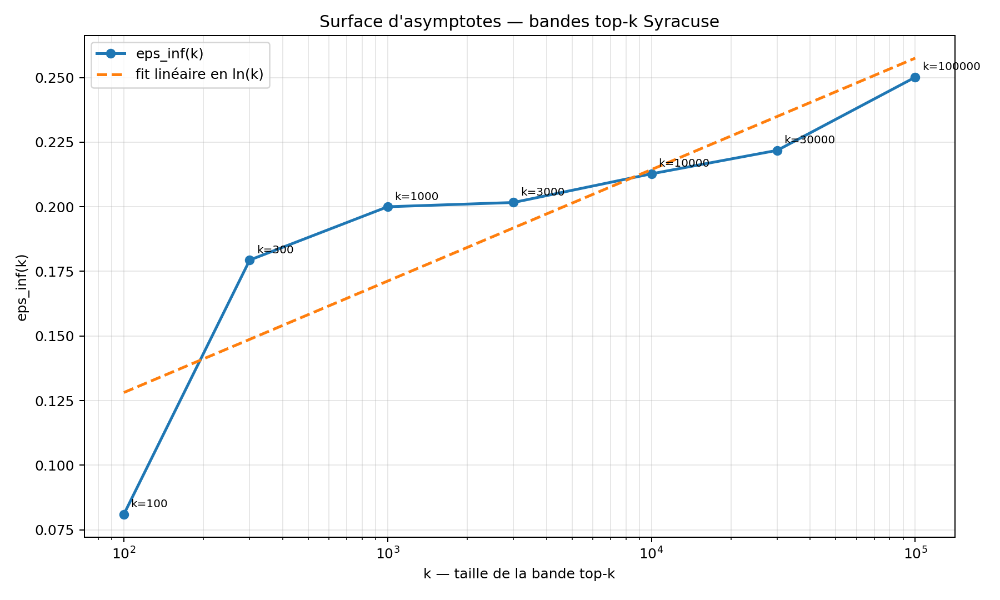

# Collatz Scan — moteur expérimental ARGOS

> **NON-PREUVE — Collatz Scan ne prouve pas la conjecture de Collatz.**
>
> Il publie du code, des observations numériques finies et des contrôles de
> reproductibilité. Une exécution réussie, un accord exact ou un grand domaine
> scanné ne constitue pas une démonstration mathématique.

Collatz Scan explore la dynamique impaire accélérée de Collatz/Syracuse. Cette
publication rassemble le scanner de records, le vérificateur de relèvement, des
analyses statistiques complémentaires et les résultats compacts fournis par
l'auteur.



## Portée des validations

| Élément | Statut de cette publication | Ce que cela établit |
| --- | --- | --- |
| Scan jusqu'à 10^6 | Contenu reproduit exactement | Le script publié régénère exactement les enregistrements de `records_1e6.csv` |
| Champion 2 788 008 987 | Contenu reproduit exactement | L'analyse publiée régénère les 282 lignes fournies |
| Trois profils de relèvement | Contenu reproduit exactement | `verify_lift.py` régénère les CSV d'accord fournis |
| Records jusqu'à (10^8,10^9,10^{10}) | Cohérence interne vérifiée | Chaque ligne publiée est recalculable ; l'exhaustivité des scans longs n'a pas été rejouée ici |
| Données top-k et surface | Données historiques contrôlées | Schémas CSV lisibles et empreintes publiées ; calcul source complet non rejoué |
| OpenCL A001 | Source et syntaxe vérifiées | Pas d'exécution GPU dans l'environnement de cette publication |
| Tests CPU A001 et zonal | Exécutés | Production déterministe d'artefacts sur 5 000 valeurs synthétiques |

Voir [DATA_STATUS.md](DATA_STATUS.md) pour la séparation entre preuve logicielle,
cohérence des fichiers et résultats historiques.

## Arborescence

- `scripts/scan_L_records.py` : scan des records (R(N)) et (L(N)) ;
- `scripts/analyze_champion.py` : analyse détaillée d'une trajectoire ;
- `scripts/verify_lift.py` : vérification du critère local de relèvement ;
- `scripts/renorm_fit.py` : ajustements exploratoires ;
- `scripts/renorm_joint.py` : ajustements conjoints exploratoires ;
- `scripts/collatz_a001_*.py` : expérience mémoire/résidu CPU et OpenCL ;
- `scripts/collatz_zone_conditioned_k_test.py` : comparaison statistique zonale ;
- `data/` : résultats compacts, sans jeu de données personnel ;
- `evidence/` : traces historiques explicitement qualifiées ;
- `tests/` : vérifications déterministes ;
- `archive/incomplete-vmean/` : sources historiques non exécutables sans le
  module source `trajectory.py`, absent des pièces transmises ;
- `SHA256SUMS` : empreintes des sources, données, preuves et figure.

Les archives opaques et les captures d'écran fournies avec le corpus ne sont pas
publiées. Une archive contient en outre des documents personnels sans rapport
avec le composant. Seuls les fichiers individuellement inspectés, nécessaires
et dépourvus de données privées ont été retenus.

## Vérification locale

Prérequis CPU : Python 3.10 ou plus récent. Aucun paquet tiers n'est nécessaire.

```bash
cd components/argos/engines/collatz
./verify.sh
```

Le chemin GPU est optionnel :

```bash
python3 -m pip install -r requirements-gpu.txt
python3 scripts/collatz_a001_memory_vs_residue_gpu.py \
  chemin/starts.csv chemin/resultats-gpu
```

## Exemples

Reproduire le scan borné à (10^6) :

```bash
python3 scripts/scan_L_records.py \
  --max-n 1000000 \
  --max-depth 3000 \
  --output /tmp/records_1e6.csv \
  --checkpoint /tmp/checkpoint_1e6.json \
  --progress-every 0 \
  --checkpoint-every 0

sha256sum /tmp/records_1e6.csv
# 0d6127ac715f0a00a21d125076dd0c4f3b6a4805bb3289329639bdee45c7cae8
```

Reproduire l'analyse du champion fourni :

```bash
python3 scripts/analyze_champion.py \
  --n0 2788008987 \
  --max-depth 1000 \
  --output /tmp/champion.csv
```

## Interprétation obligatoire

Les calculs sont bornés par `--max-n`, `--max-depth`, le fichier d'entrée et
les hypothèses codées. « Aucun contre-exemple observé » signifie seulement
« aucun contre-exemple observé dans ce domaine avec ce programme ».

Les mots `PASS`, `EXACT`, `SUPPORTED`, `NOT_SUPPORTED` et
`INCONCLUSIVE` décrivent des contrôles logiciels ou statistiques locaux.
Ils ne décrivent jamais le statut de la conjecture.

Lire [NON_CLAIMS.md](NON_CLAIMS.md) avant toute citation.
